# Behdashtik WordPress Data Hub

A two-environment data pipeline that mirrors a WooCommerce production database to a read-only MySQL replica and dispatches webhooks on change. The WordPress connector plugin exports data on demand; Server 2 imports, validates, and keeps the mirror fresh via near-real-time event sync.

## Environment overview

| | DEV | PROD |
|---|---|---|
| **Repo path** | `/root/wordpress-data-hub/` | `/root/behdashtik-hub-main/` |
| **WP source** | `https://dev.behdashtik.ir` | `https://behdashtik.ir` |
| **Mirror DB** | `behdashtik_wp_mirror_dev` | `behdashtik_wp_mirror` |
| **Hub state DB** | `behdashtik_hub_state_dev` | `behdashtik_hub_state` |
| **MySQL port** | 3308 | 3308 |
| **Dashboard port** | 8089 | 8090 |
| **Pipeline log** | `/var/log/bdsk-pipeline.log` | `/var/log/bdsk-mainhub-pipeline.log` |
| **`BDSK_ENV`** | `dev` | `main` |

## Architecture

```mermaid
flowchart TD
    subgraph WP_DEV ["WordPress DEV (dev.behdashtik.ir)"]
        WC_D[WooCommerce]
        Plugin_D["behdashtik-mirror-connector v1.7.0"]
        Outbox_D[(wp_bdsk_event_outbox)]
        WC_D -->|hooks| Plugin_D
        Plugin_D --> Outbox_D
    end

    subgraph WP_PROD ["WordPress PROD (behdashtik.ir)"]
        WC_P[WooCommerce]
        Plugin_P["behdashtik-mirror-connector v1.7.0"]
        Outbox_P[(wp_bdsk_event_outbox)]
        WC_P -->|hooks| Plugin_P
        Plugin_P --> Outbox_P
    end

    subgraph S2_DEV ["Server 2 — DEV hub (/root/wordpress-data-hub)"]
        Pipeline_D[pipeline.py]
        Dashboard_D["dashboard.py\n(127.0.0.1:8089)"]
        HubDB_D[(hub.db SQLite\nwebhook config)]
        Config_D[".env + bdsk_config.py\nENV=dev  safety guards"]
    end

    subgraph S2_PROD ["Server 2 — PROD hub (/root/behdashtik-hub-main)"]
        Pipeline_P[pipeline.py]
        Dashboard_P["dashboard.py\n(127.0.0.1:8090)"]
        HubDB_P[(hub.db SQLite\nwebhook config)]
        Config_P[".env + bdsk_config.py\nENV=main  safety guards"]
    end

    subgraph MySQL ["MySQL :3308 (shared server)"]
        MirrorDev[(behdashtik_wp_mirror_dev)]
        StagingDev[(…_mirror_dev_staging\nduring import)]
        HubStateDev[(behdashtik_hub_state_dev\npersistent — never swapped)]
        MirrorProd[(behdashtik_wp_mirror)]
        StagingProd[(…_mirror_staging\nduring import)]
        HubStateProd[(behdashtik_hub_state\npersistent — never swapped)]
    end

    subgraph Consumers ["External consumers"]
        Webhook[Outbound webhook endpoints\nHMAC-SHA256 signed]
    end

    Pipeline_D -->|POST /db-export/start| Plugin_D
    Pipeline_D -->|import → validate → swap| StagingDev
    StagingDev -->|swap| MirrorDev
    Pipeline_D -->|GET /events/pending| Outbox_D
    Pipeline_D -->|apply deltas| MirrorDev
    Pipeline_D -->|bdsk_ tables| HubStateDev
    Pipeline_D -->|HMAC-signed POST| Webhook
    Dashboard_D -->|reads| MirrorDev
    Dashboard_D -->|reads| HubStateDev

    Pipeline_P -->|POST /db-export/start| Plugin_P
    Pipeline_P -->|import → validate → swap| StagingProd
    StagingProd -->|swap| MirrorProd
    Pipeline_P -->|GET /events/pending| Outbox_P
    Pipeline_P -->|apply deltas| MirrorProd
    Pipeline_P -->|bdsk_ tables| HubStateProd
    Pipeline_P -->|HMAC-signed POST| Webhook
    Dashboard_P -->|reads| MirrorProd
    Dashboard_P -->|reads| HubStateProd
```



## Data flows

| Flow | Trigger | DEV cadence | PROD cadence |
|---|---|---|---|
| **Full export + import** | `pipeline.py` (no flags) | 2 AM daily | 3 AM daily |
| **Event sync** | `pipeline.py --event-sync` | Every minute | Every minute |
| **Media sync** | `pipeline.py --media-sync` | Every 5 min + 3 AM | 3:30 AM daily |
| **Media full resync** | `pipeline.py --media-sync-full` | Sundays 4 AM | — |
| **Prune** | `pipeline.py --prune` | 5 AM daily | — |
| **Webhook dispatch** | Automatic after each event apply | Same as event sync | Same as event sync |

### Full-sync flow (backup → staging → validate → swap)

```
pipeline.py (no flags)
  1. health_check()          — verify plugin is reachable and enabled
  2. start_export()          — POST /db-export/start → job_id
  3. poll_until_ready()      — GET /db-export/status until complete
  4. download_archive()      — GET /db-export/download (gzip, stored in data/db-archives/)
  5. import_archive()        — gunzip + mysql into <mirror>_staging DB
  6. validate_import()       — row-count + table sanity checks on staging
  7. swap_staging_to_mirror() — DROP mirror; mysqldump staging | mysql mirror; DROP staging
  8. update_meta()            — mark archive as success; archive retained 5 months
```

If validation fails at step 6, staging is preserved for debugging and the mirror is **not** touched.

### Event-sync flow

```
pipeline.py --event-sync
  1. GET /events/pending?after_id=<cursor>  — fetch up to 200 pending events
  2. Deduplicate by (entity_type, entity_id); keep last event per entity
  3. For each entity:
       GET /snapshot/<entity_type>/<id>     — full row snapshot from WP
       Apply upsert or delete to mirror DB (wp_posts, wp_postmeta, wp_wc_orders, …)
  4. Write to bdsk_event_log in hub_state DB (not mirror — survives swap)
  5. POST /events/ack  — mark events acknowledged on WP side
  6. Advance after_id cursor
```

Entity types: `product`, `order`, `attachment`, `term`.

### Media-sync flow

```
pipeline.py --media-sync
  1. GET /media-manifest  — paged manifest of all attachment URLs + metadata
  2. Upsert into bdsk_local_media_index (in hub_state DB — survives swap)
  3. Mark manifest_status='deleted' rows; delete local files; update status
  4. Download pending files to data/media/<attachment_id>/<filename>
  5. Update download_status in hub_state DB
```

### Outbound webhook behavior

Webhooks are **outbound only** — the Hub pushes to external HTTP endpoints. There is no inbound receiver.

- Endpoints registered via the dashboard `/webhooks` page, stored in `hub.db`.
- After each successful event apply, `_dispatch_webhooks()` sends a signed HTTP POST to all matching active endpoints.
- Signing: `X-BDSK-Signature: <HMAC-SHA256 hex>` using a per-endpoint secret.
- Delivery is logged in `hub.db → webhook_deliveries` regardless of success/failure.
- Webhook failure is non-fatal — mirror correctness is unaffected.

### Hub state DB separation

`bdsk_local_media_index` and `bdsk_event_log` live in a **persistent hub_state DB**, separate from the swappable mirror DB.

| DB | Purpose | Survives swap? |
|---|---|---|
| `behdashtik_wp_mirror_dev` / `behdashtik_wp_mirror` | Mirror of WordPress data | ✗ Wiped on every full-sync swap |
| `behdashtik_hub_state_dev` / `behdashtik_hub_state` | Event cursor, media index | ✓ Never touched by swap |

This means `after_id` event cursors and downloaded media records are never lost when a fresh full-sync replaces the mirror.

## .env safety guards

`server2/bdsk_config.py` loads `server2/.env` and enforces these rules at startup — any violation aborts with `[SAFETY FAIL]`:

| Rule | Guard |
|---|---|
| `BDSK_ENV=dev` → mirror DB must end with `_dev` | Hard fail |
| `BDSK_ENV=dev` → hub_state DB must end with `_dev` | Hard fail |
| `BDSK_ENV=main/prod` → mirror DB must NOT end with `_dev` | Hard fail |
| `BDSK_ENV=main/prod` → hub_state DB must NOT end with `_dev` | Hard fail |
| `dev.` in WP source URL → mirror DB must end with `_dev` | Hard fail |
| Production URL → mirror DB must NOT end with `_dev` | Hard fail |
| `mirror_db.name == hub_state_db.name` | Hard fail |
| Storage paths outside project root | Warn only |

Run `python3 pipeline.py --show-config` to print the sanitized active config (secrets masked as `***`).

## Production rollout checklist

Before enabling the production hub:

- [ ] Activate `behdashtik-mirror-connector` plugin on `behdashtik.ir` (WP admin → Plugins)
- [ ] Create `server2/.env` in hub-main from `.env.example`; set `BDSK_ENV=main`
- [ ] Set production API secret in hub-main `.env` (match WP plugin settings)
- [ ] Run `python3 pipeline.py --health-only` from hub-main to verify connectivity
- [ ] Run `python3 pipeline.py --show-config` to confirm all safety guards pass
- [ ] Confirm 3 AM cron full-sync completes successfully (check `/var/log/bdsk-mainhub-pipeline.log`)
- [ ] Start hub-main dashboard: `python3 dashboard.py` (port 8090)
- [ ] Confirm `mirror_readonly` user has SELECT grants on `behdashtik_hub_state` and `behdashtik_wp_mirror`

### Known remaining operator actions

- **Production plugin**: must be activated on `behdashtik.ir` before any PROD sync runs
- **Hub-main `.env`**: does not exist yet — create from `server2/.env.example`
- **Hub-main dashboard**: not running — start manually after `.env` is in place
- **DEV duplicate media-sync cron**: `0 3 * * *` line is redundant alongside `*/5 * * * *`; safe to remove

## Local dev quick-start

### Prerequisites

- Docker + Docker Compose
- Python 3.12+

### 1 — Start the local stack

```bash
cd docker/
cp .env.example .env        # passwords already set for local dev
docker compose up -d
```

This brings up WordPress on `http://localhost:8080` with a local MySQL backend. The plugin is volume-mounted live.

Activate once:

```bash
docker compose run --rm wpcli plugin activate behdashtik-mirror-connector
```

### 2 — Configure Server 2

```bash
cd server2/
cp .env.example .env      # never commit .env
```

Edit `server2/.env` with your WP source URL, API secret, and DB credentials. Or use `config.json` as a fallback:

```bash
cp config.example.json config.json
```

Install Python deps:

```bash
pip install -r requirements.txt
```

### 3 — Run the pipeline

```bash
python3 pipeline.py --show-config    # confirm config + safety guards
python3 pipeline.py --health-only    # verify WP connectivity
python3 pipeline.py                  # full export + import
python3 pipeline.py --event-sync     # process pending events
python3 pipeline.py --media-sync     # download media files
```

### 4 — Dashboard

```bash
cd server2/
python3 dashboard.py     # listens on 127.0.0.1:8089 (BDSK_DASHBOARD_PORT)
```

Open `http://localhost:8089`. First run creates `hub.db` and prompts for admin user.

## Key files

```
wordpress-plugin/
  behdashtik-mirror-connector/          # plugin source (v1.7.0)
    behdashtik-mirror-connector.php     # entry point, version constant
    includes/
      class-bdsk-db.php                 # table definitions + CRUD helpers
      class-bdsk-export-job.php         # chunked export via Action Scheduler
      class-bdsk-export-rest.php        # REST: /db-export/*, /health
      class-bdsk-event-outbox.php       # WC hook listeners, outbox + attachment hooks
      class-bdsk-event-rest.php         # REST: /events/*, /snapshot/*
      class-bdsk-media-index.php        # attachment change tracking
      class-bdsk-media-rest.php         # REST: /media-manifest
      class-bdsk-health.php             # /health payload builder
      class-bdsk-security.php           # HMAC auth, key management
      class-bdsk-cleanup.php            # hourly AS cleanup
      class-bdsk-stats.php              # dashboard stats
      class-bdsk-settings-page.php      # WP admin settings page

server2/
  bdsk_config.py          # shared config loader: dotenv + env-var overlay + safety guards
  pipeline.py             # CLI: full export, event sync, media sync, webhooks
  dashboard.py            # Flask web dashboard
  data_api.py             # read-only REST API blueprint (/api/v1)
  .env.example            # config template (commit); .env = real values (gitignored)
  config.example.json     # fallback JSON config template
  requirements.txt

dist/
  behdashtik-mirror-connector.zip   # built plugin zip for WordPress upload

data/
  db-archives/            # downloaded export archives (gitignored)
  media/                  # synced WP attachments (gitignored)
```

## Security model

- Plugin REST endpoints: HMAC-SHA256 `Authorization: Bearer <api_secret>`.
- Download tokens (`X-BDSK-Download-Token`, 6-hour TTL) keep tokens out of nginx logs.
- Outbound webhook payloads: `X-BDSK-Signature: <HMAC-SHA256>` per-endpoint secret.
- `config.json`, `.env`, `hub.db` are gitignored.
- Mirror DB users: `mirror_import` (write during import), `mirror_readonly` (SELECT only).
- `.env` safety guards hard-fail on env/DB mismatches before any network or DB operation.

## Version history

| Version | Milestone |
|---|---|
| 1.0.0 | Phase 1 — chunked export + import pipeline |
| 1.2.0 | Phase 2 — media manifest sync |
| 1.3.0 | Phase 3 — event outbox (near-real-time event sync) |
| 1.4.0 | Phase 4 — stats, rate limiting, admin UI, hub dashboard |
| 1.5.0 | Phase 5 — hub login system, outbound webhook dispatcher |
| 1.6.0 | Phase 6 — hub_state DB split; event cursor + media index survive mirror swaps |
| 1.7.0 | Phase 7 — attachment event sync; `.env` safety guards; dual-env (DEV/PROD) separation |
