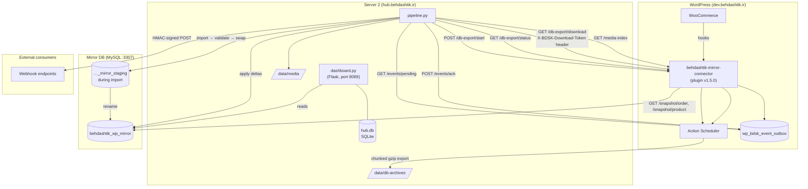

# Behdashtik WordPress Data Hub

A two-server data pipeline that mirrors a WooCommerce database to a read-only MySQL replica and dispatches webhooks on change. The WordPress side exports data on demand; Server 2 imports, validates, and keeps the mirror fresh via near-real-time event sync.

## Architecture



### Data flows

| Flow | Trigger | Cadence |
|---|---|---|
| **Full export** | Server 2 calls `/db-export/start` | Daily (or manual) |
| **Event sync** | Server 2 polls `/events/pending` | Every ~60 s via cron |
| **Media sync** | Server 2 calls `--media-sync` | Daily |
| **Webhook dispatch** | Automatic after each event sync apply | Same cadence as event sync |

## Local dev quick-start

### Prerequisites

- Docker + Docker Compose
- Python 3.11+
- Node 18+ (only needed if using the skills CLI)

### 1 — Start the local stack

```bash
cd docker/
cp .env.example .env        # passwords are already set for local dev
docker compose up -d
```

This brings up:
- **WordPress** on `http://localhost:8080` (MySQL backend)
- **Mirror DB** on `localhost:3307` (separate MySQL for the replica)

The plugin is volume-mounted live from `wordpress-plugin/behdashtik-mirror-connector/` — no sync needed.

Activate the plugin once via WP-CLI:

```bash
docker compose run --rm wpcli plugin activate behdashtik-mirror-connector
```

### 2 — Configure Server 2

```bash
cd server2/
cp config.example.json config.json   # never commit config.json
```

Edit `config.json`:

```json
{
  "wp_base_url": "http://localhost:8080",
  "api_secret": "<copy from WP admin → Behdashtik → Settings>",
  "archive_storage_path": "../data/db-archives",
  "mirror_db": {
    "host": "127.0.0.1",
    "port": 3307,
    "user": "mirror_import",
    "password": "mirrorpass",
    "name": "behdashtik_wp_mirror"
  }
}
```

Install Python dependencies:

```bash
pip install -r requirements.txt
```

### 3 — Run the pipeline

```bash
# Health check only
python3 pipeline.py --health-only

# Full export + import (takes a few minutes)
python3 pipeline.py

# Near-real-time event sync (run once; cron runs it repeatedly in production)
python3 pipeline.py --event-sync

# Media sync (incremental)
python3 pipeline.py --media-sync
```

### 4 — Start the dashboard (optional)

```bash
cd server2/
python3 dashboard.py    # listens on 127.0.0.1:8089 by default
```

Open `http://localhost:8089`. The first-run creates `hub.db` and prompts for admin account setup.

### 5 — Deploy plugin changes to production

```bash
cd deploy/
./sync-plugin.sh --deploy-to-production   # rsync + WP-CLI opcache/rewrite flush
```

## Key files

```
wordpress-plugin/
  behdashtik-mirror-connector/
    behdashtik-mirror-connector.php   # entry point, version constant
    includes/
      class-bdsk-db.php               # table definitions + CRUD helpers
      class-bdsk-export-job.php       # chunked export via Action Scheduler
      class-bdsk-export-rest.php      # REST routes: /db-export/*, /health
      class-bdsk-event-outbox.php     # WC hook listeners, outbox table
      class-bdsk-event-rest.php       # REST routes: /events/*, /snapshot/*
      class-bdsk-media-index.php      # attachment change tracking
      class-bdsk-media-rest.php       # REST route: /media-index
      class-bdsk-health.php           # /health payload builder
      class-bdsk-security.php         # HMAC auth, key management
      class-bdsk-cleanup.php          # hourly AS cleanup job
      class-bdsk-stats.php            # dashboard stats

server2/
  pipeline.py        # CLI: full export, event sync, media sync, webhooks
  dashboard.py       # Flask web dashboard (hub.behdashtik.ir)
  config.example.json
  requirements.txt

docker/
  docker-compose.yml
  .env.example
  mirror-db-init/01-users.sql   # creates mirror_import + mirror_readonly users

deploy/
  sync-plugin.sh    # rsync deploy to production WP server

data/
  db-archives/      # downloaded export gzip files (gitignored)
  media/            # synced WP attachment files (gitignored)
```

## Security model

- All plugin REST endpoints require an HMAC-SHA256 `Authorization` header signed with the shared `api_secret`.
- Download tokens (`X-BDSK-Download-Token` request header, 6-hour TTL) keep tokens out of nginx access logs.
- Webhook payloads are signed with per-endpoint secrets (`X-BDSK-Signature: sha256=<hex>`).
- `config.json` and `hub.db` are gitignored and must never be committed.
- The mirror DB has two MySQL users: `mirror_import` (full write during import) and `mirror_readonly` (SELECT only for application reads).

## Version history

| Version | Milestone |
|---|---|
| 1.0.0 | Phase 1 — chunked export + import pipeline |
| 1.2.0 | Phase 2 — media index sync |
| 1.3.0 | Phase 3 — event outbox (near-real-time sync) |
| 1.4.0 | Phase 4 — stats, rate limiting, admin UI, hub dashboard |
| 1.5.0 | Phase 5 — hub login system, webhook dispatcher |
